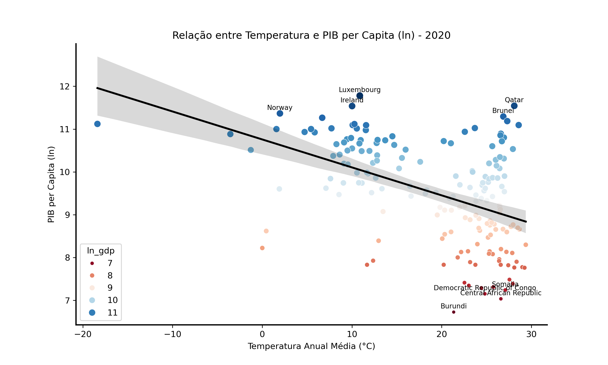
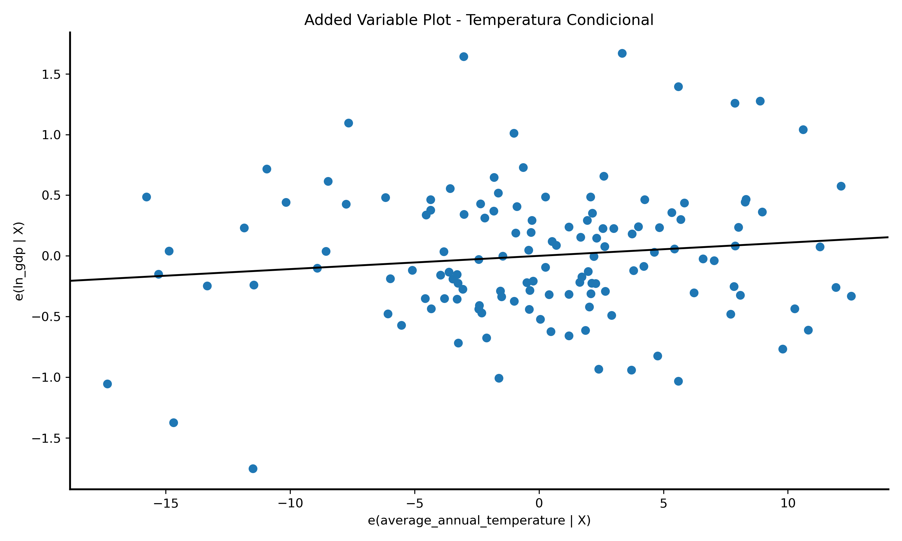
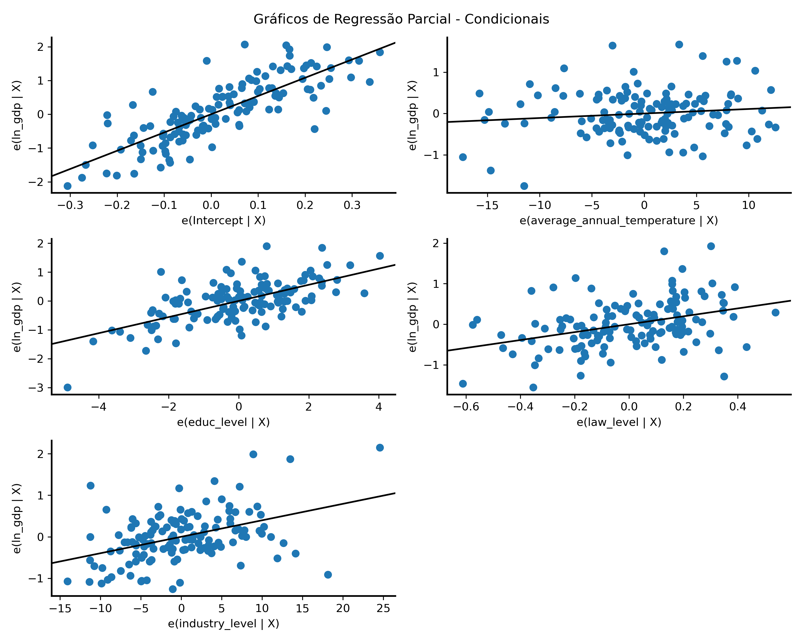

# causal-inf-temperature-gdp

## Impacto Causal da Temperatura no PIB per Capita

Este projeto foi desenvolvido com o objetivo de introduzir, de forma teórica e prática, os conceitos de inferência causal para o time de Data Science no qual atuava.

Como a principal proposta era demonstrar exemplos práticos e aplicáveis, optei por explorar uma relação amplamente discutida na literatura: a correlação entre temperatura média anual e PIB per capita. Essa escolha se deu pela oportunidade de ilustrar, de maneira concreta, como variáveis confundidoras podem distorcer a interpretação de relações causais. A relação entre PIB e temperatura tem sido objeto de diversos estudos ao longo dos anos, permanecendo relevante até os dias atuais.

### Objetivo

A motivação deste trabalho surge da observação de que países com climas mais quentes frequentemente apresentam PIB per capita mais baixo, o que leva à seguinte pergunta:

Será que a temperatura, de fato, causa menor desenvolvimento econômico?

Essa hipótese inicial se sustenta, em parte, pela análise do gráfico abaixo. Nele, observa-se que países como Qatar, Noruega e Luxemburgo apresentam alto PIB per capita e baixas temperaturas médias, enquanto países com PIB mais baixo, especialmente na África, estão associados a temperaturas mais elevadas. Essa relação reforça uma correlação negativa aparente entre as variáveis de interesse.

Fonte: Resultados do projeto

Este é um exemplo clássico onde a confusão entre correlação e causalidade pode levar a conclusões equivocadas. Uma análise superficial, baseada apenas na correlação observada, poderia levar à interpretação incorreta de que o clima, isoladamente, determina o desenvolvimento econômico.

### Metodologia e Premissas
#### Dados utilizados:
* PIB per capita (PPP, constante 2021) – Banco Mundial
* Temperatura média anual – Berkeley Earth
* Anos médios de escolaridade – Our World in Data
* Emprego na indústria (% do total) – Banco Mundial
* Índice de Rule of Law (Qualidade institucional) – Worldwide Governance Indicators

#### Principais premissas:
O modelo com controles assume que, condicionado às variáveis de educação, instituições e estrutura econômica, não há confundidores não observados entre temperatura e PIB.

A relação entre temperatura e PIB é assumida como aproximadamente linear dentro da faixa observada.

### Resultados

| Modelo | ATE (Temperatura) | Interpretação |
| --- | --- | --- |
| Efeito isolado de Temperatura no PIB | -0.0653 | Aumentar 1°C → queda de 6,53% no PIB per capita |
| Efeito de Temperatura no PIB com confounders | 0.0109 | Aumentar 1°C → aumento de 1,09% no PIB per capita |

A análise revela um ponto crucial: quando consideramos apenas a relação bruta entre temperatura e PIB, o efeito parece fortemente negativo (**ATE = -0.0653**). Contudo, ao controlar por fatores como educação, qualidade das instituições e participação da indústria na economia, esse efeito não apenas desaparece como inverte o sinal (**ATE = 0.0109**), indicando que a temperatura, por si só, não é responsável pelo baixo desenvolvimento econômico observado em países mais quentes.

O gráfico a seguir mostra a relação entre uma variável independente específica (Temperatura) e a variável dependente (PIB), condicionando pelo efeito das demais variáveis do modelo. 

O funcionamento do gráfico baseia-se no conceito de resíduos. Primeiramente, calcula-se a parte da variável dependente, neste caso o log do PIB per capita, que não é explicada pelas demais variáveis do modelo, exceto pela variável de interesse. Esse processo é feito ajustando uma regressão da variável dependente contra todas as outras variáveis de controle, removendo assim o seu efeito. O resultado dessa regressão são os resíduos, que representam aquilo que sobra da variável dependente depois de controlar os confundidores.

De forma análoga, realiza-se o mesmo processo com a variável de interesse, que também é regressada nas variáveis de controle. Isso gera um segundo conjunto de resíduos, que representa a parte da variável de interesse que não pode ser explicada pelas demais variáveis do modelo.

O gráfico é então construído colocando os resíduos da variável dependente no eixo y e os resíduos da variável de interesse no eixo x. A linha de regressão traçada sobre esses pontos tem uma interpretação direta: sua inclinação corresponde exatamente ao coeficiente da variável de interesse no modelo completo, isto é, ao seu efeito condicional, controlando pelos confundidores. Esse gráfico permite, portanto, observar se ainda existe uma relação linear relevante entre a variável de interesse e o desfecho, depois de ajustar os efeitos de todas as outras variáveis.

Fonte: Resultados do projeto

Além disso, conseguimos verificar a influência das demais métricas no PIB per capita do país, sendo correlações positivas e mais relevantes do que a própria temperatura, que é o serne da discussão.

Isso ilustra de forma clara a importância da inferência causal na análise de dados, destacando como confundidores podem gerar interpretações equivocadas quando não são devidamente controlados.

Fonte: Resultados do projeto

O gráfico estende o conceito do Added Variable Plot (gráfico anterior) para todas as variáveis explicativas do modelo de regressão. Ele permite visualizar, de forma simultânea, como cada variável independente se relaciona com a variável dependente, uma vez que os efeitos das demais variáveis foram removidos.

### Conclusão

Este projeto demonstra, de forma prática, um dos principais riscos que empresas e profissionais enfrentam ao analisar dados: **confundir correlação com causalidade**. Uma análise superficial, baseada apenas na correlação entre temperatura e PIB per capita, poderia levar à conclusão equivocada de que o clima, por si só, determina o desenvolvimento econômico dos países. No entanto, quando controlamos por variáveis estruturais, como educação, qualidade institucional e composição da economia, percebemos que a influência direta da temperatura é muito menor do que aparentava inicialmente.

Esse exemplo traduz um desafio que está presente em praticamente todas as análises de dados dentro das organizações. Muitas vezes, *decisões são tomadas com base em relações aparentes que, na prática, são reflexo de outros fatores não observados ou não controlados*. A inferência causal surge, portanto, como uma competência essencial para empresas que desejam tomar decisões baseadas em evidências sólidas, indo além da simples descrição dos dados e se aproximando de respostas para perguntas como "O que realmente gera impacto no nosso negócio?" ou "O que aconteceria se eu mudasse determinada variável?" sem a viabilidade de testes estatísticos mais controlados.

Mais do que uma análise sobre clima e economia, este projeto reforça a importância de construir análises robustas, capazes de diferenciar o que é simplesmente correlação do que é, de fato, causa. Esse olhar é fundamental para empresas que buscam reduzir riscos, melhorar a eficiência operacional e gerar vantagem competitiva a partir de dados.

### Referências

Jun-Jie Chang, Zhifu Mi, Yi-Ming Wei,Temperature and GDP: A review of climate econometrics analysis, Structural Change and Economic Dynamics, Volume 66, 2023, Pages 383-392, https://doi.org/10.1016/j.strueco.2023.05.009.

Richard G. Newell, Brian C. Prest, Steven E. Sexton, The GDP-Temperature relationship: Implications for climate change damages, Journal of Environmental Economics and Management, Volume 108, 2021, https://doi.org/10.1016/j.jeem.2021.102445.